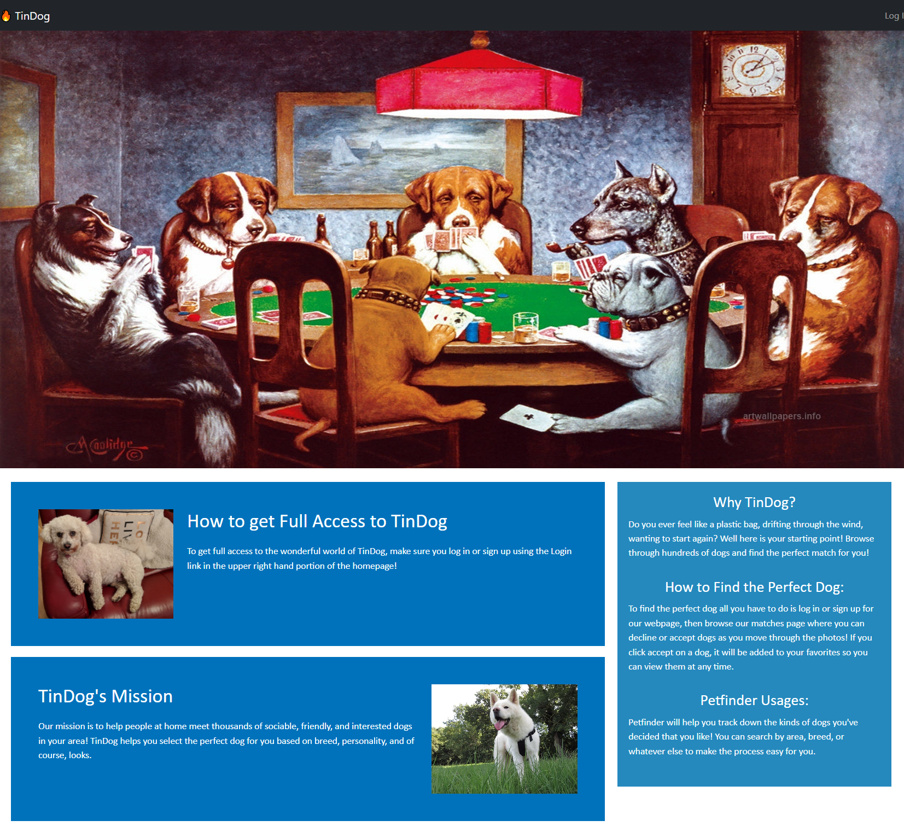

# tindog

https://tindog.herokuapp.com/

## Description

Welcome to TinDogs! Tinder for Dogs!

Are you looking to adopt a dog, but don't know where or how to begin looking?
Leave it to us, Tinder Dogs is a web app designed to help potential dog owners find quick 
information about dogs of various different breeds.

Sometimes the information online can be overwhelming to users. Our solution? Gamify the 
most difficult aspects of starting to find information about potential pets. The Tinder
swipe right/left model just happens to be one of the easiest routes to gamifying dog adoption.

## Installation

No installations necessary! Simply go to our website at: https://tindog.herokuapp.com/
And create an account to get started!

## Usage

Create an account, swipe left on dogs you dislike, right on dogs you do like, and we'll compile
that information for you on our servers for your convenience. We provide handy url's to 
petfinder's own website in order to direct you towards further information on each of your
future beloved companions. 

## Credits

A link to our github with all its contributors can be found here:
https://github.com/YockaFlocka/tindog

Ian: https://github.com/thinkbui
Jon: https://github.com/JHelton404
Peter: https://github.com/YockaFlocka
Lucas: https://github.com/lippertnegenl
Aurelio: https://github.com/Acotroneo91
